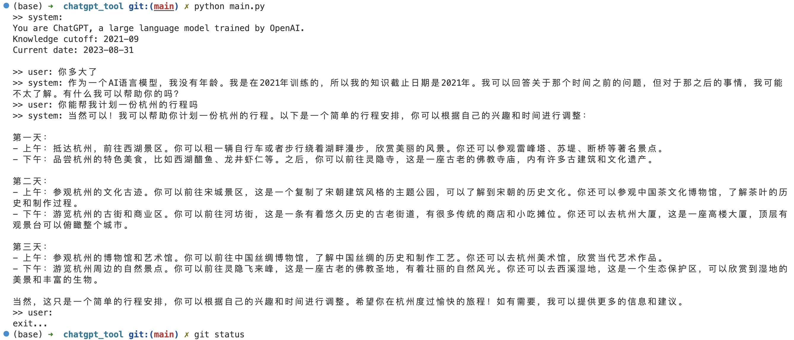

### How to run

```
pip install -r requirements.txt
```

Then run it:

```
export OPENAI_API_KEY=<you-openai-api-key> # you can put it to .bashrc/.zshrc
python main.py
```

Example: 



### Reference

- https://github.com/lm-sys/FastChat
