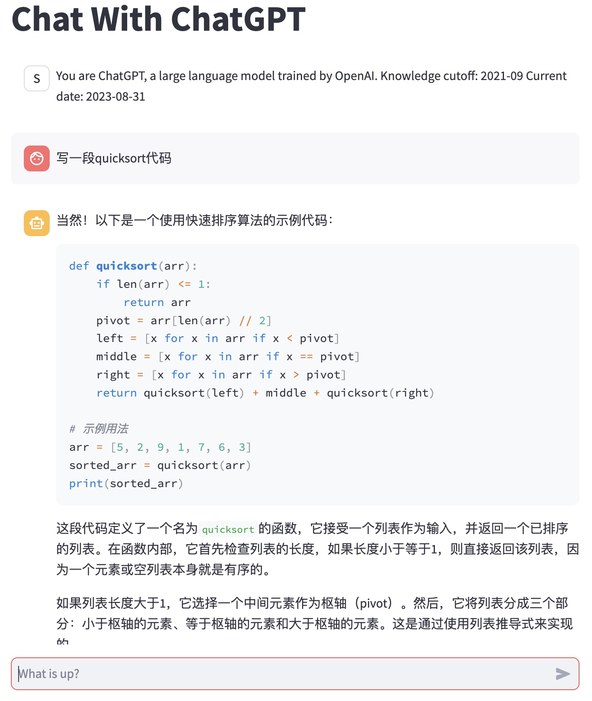
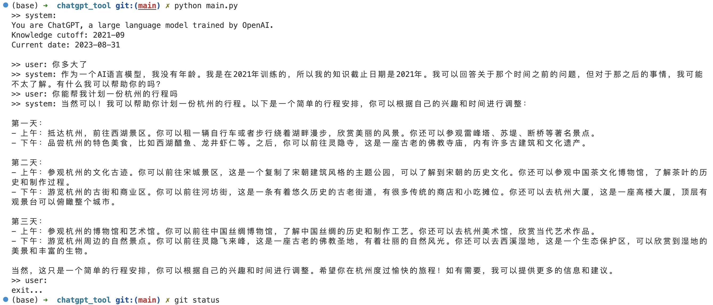

## How to run

```
pip install -r requirements.txt
```

Put OPENAI_API_KEY to `./streamlit/secrets.toml` (if not exist please create it). Replace `<you-openai-api-key>` with your own key,
```
OPENAI_API_KEY = "<you-openai-api-key>"
```

### Web UI
```
streamlit run main_web.py
```


### CLI UI:

```
python main_cli.py
```



## References

- https://github.com/lm-sys/FastChat
- https://docs.streamlit.io/knowledge-base/tutorials/build-conversational-apps#write-the-app
